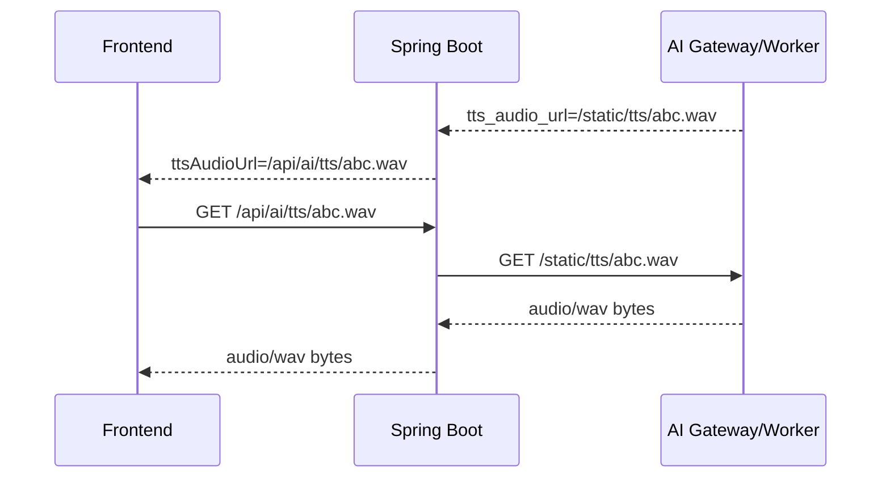
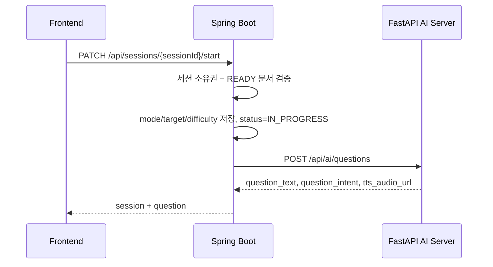
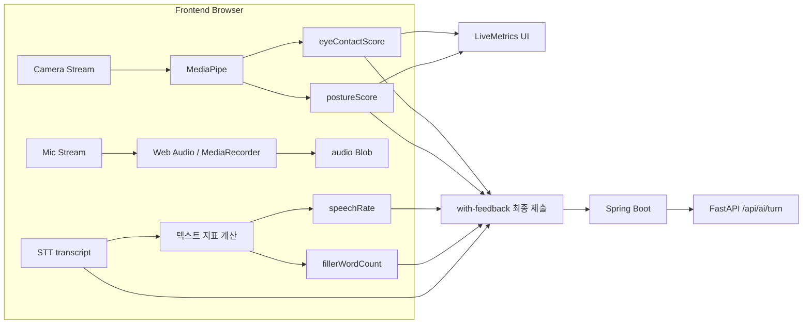
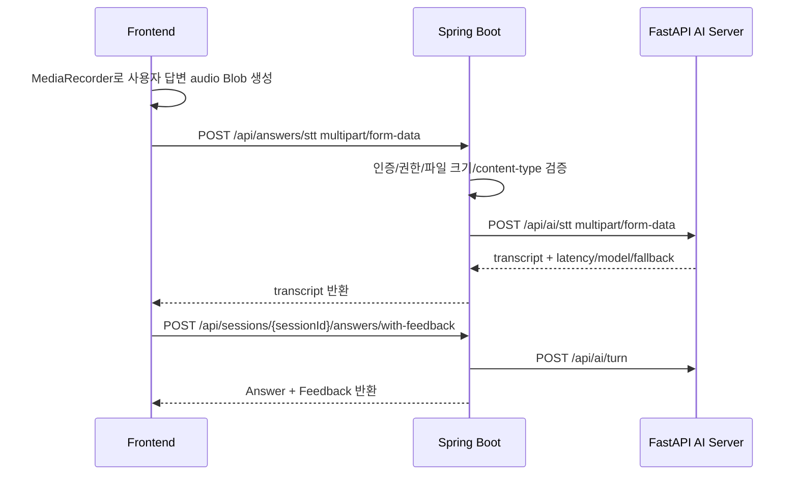
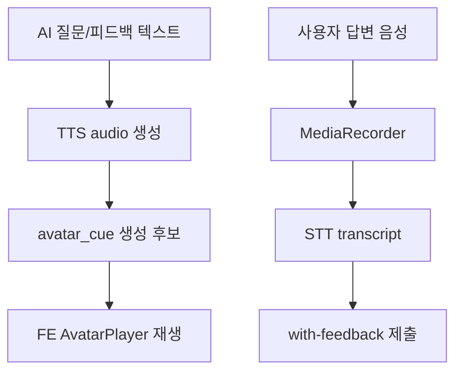
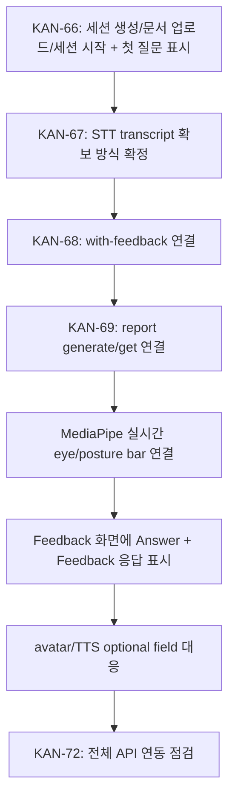

# Live AI/STT/MediaPipe 연동 논의 정리

작성일: 2026-05-06
업데이트: 2026-05-07
대상: Frontend / Spring Boot Backend / FastAPI AI Server 협업 논의

## 1. 결론 요약

현재 최신 `backend/dev`와 `ai-server` 기준으로 확인한 결론은 다음과 같다.

- 운영 환경에서 Frontend는 FastAPI AI Server를 직접 호출하지 않는다.
- Frontend는 Spring Boot 제품 API만 호출한다.
- Spring Boot는 이미 FastAPI AI Server를 호출하는 `AiGatewayClient`를 보유한다.
- 세션 시작, 턴 피드백, 리포트 생성은 Spring Boot 경유 구조가 구현되어 있다.
- STT는 아직 Spring 제품 API로 노출되어 있지 않다. FastAPI에는 `/api/ai/stt`가 있으므로 Spring 중개 API가 필요하다.
- TTS 파일은 AI Server 내부 상대 URL로 내려오므로, 운영 환경에서는 Spring 또는 AI Gateway가 프론트용 HTTP proxy URL로 변환하는 방식이 적합하다.
- MediaPipe 기반 카메라 지표는 Frontend 브라우저에서 실시간 계산하고 즉시 UI에 표시한다.
- Spring/AI Server에는 답변 종료 시점의 최종 집계값만 제출한다.
- `durationSec`는 STT 파일 업로드 스펙이 아니라 최종 답변 제출 DTO의 필드다.
- `silenceCount`는 현재 실시간 UI에서 제외한다. 백엔드 요청 필드가 유지되는 동안은 MVP 기본값 또는 후속 계산값으로 보낼지 별도 결정한다.
- 원본 오디오 파일은 MVP에서 저장하지 않는 방향이다. GCS는 사용자 document 저장과 LLM 활용을 위한 용도다.

## 2. 역할 경계

| 영역 | Frontend | Spring Boot Backend | FastAPI AI Server |
|---|---|---|---|
| 세션 생성 | `POST /api/sessions` 호출, `sessionId` 보관 | READY 세션 row 생성, session event 기록 | 관여 없음 |
| 문서 업로드 | Signed URL 요청, GCS PUT, 완료 처리 호출 | 문서 metadata 저장, GCS 검증, `READY_FOR_AI` 처리 | 현재 직접 관여 없음 |
| 세션 시작 | 옵션 제출, 첫 질문 수신 | READY 문서 검증, 세션 `IN_PROGRESS`, 첫 질문 생성 중개 | `/api/ai/questions` |
| 카메라 지표 | MediaPipe로 실시간 계산, LiveMetrics 표시 | 최종 점수 저장/AI 전달 | 최종 `vision_metrics`를 피드백/리포트에 참고 |
| 마이크/STT | MediaRecorder로 audio Blob 생성 가능 | STT 중개 API 필요 | `/api/ai/stt` 존재 |
| 답변/피드백 | 답변 종료 시 `with-feedback` 호출 | Answer 저장, AI turn 호출, Feedback 저장 | `/api/ai/turn` |
| 리포트 | 완료 세션 리포트 조회/생성 호출 | 답변/피드백 수집, AI report 호출, Report 저장 | `/api/ai/reports` |
| 아바타/TTS | audio URL/avatar cue 재생 후보 | FE 접근 가능한 URL/proxy 변환 필요 | 질문/피드백 TTS URL 생성 후보 |

### 2.1 TTS URL proxy 방식 검토

현재 AI Worker는 TTS 결과 wav 파일을 자기 static directory에 생성하고, 응답에는 파일 자체가 아니라 내부 상대 URL을 담는다.

```json
{
  "tts_audio_url": "/static/tts/abc.wav"
}
```

이 값을 Frontend가 그대로 읽으면 운영 환경에서 FastAPI 또는 AI Worker 주소가 노출되거나, 브라우저가 Spring이 아닌 AI 서버를 직접 호출하게 된다. 따라서 프로젝트 원칙상 Frontend에는 Spring 제품 API URL만 노출하는 것이 맞다.

권장 흐름:



이 방식은 일반적인 HTTP reverse proxy 방식이다.

적합한 이유:

- Frontend는 Spring Boot만 호출한다는 운영 원칙과 맞다.
- AI Worker 내부 URL과 token/header 정책을 브라우저에 노출하지 않는다.
- TTS 파일 접근 권한을 Spring의 로그인 세션/세션 소유권 기준으로 제한할 수 있다.
- 추후 AI Worker가 Cloud Run 내부망, 별도 gateway, storage signed URL 등으로 바뀌어도 FE 계약은 유지된다.

주의할 점:

- Spring proxy endpoint는 path traversal 방지가 필요하다. 예: `..`, 절대경로 차단.
- 응답 `Content-Type`은 `audio/wav` 또는 원본 content type을 유지한다.
- 짧은 TTS 파일은 단순 streaming proxy로 충분하다. 대용량/장기 보관이 필요해지면 GCS object로 승격하는 방식을 별도 검토한다.
- 현재 FastAPI gateway 코드에는 `/static/tts/{file}` proxy가 있으나, Spring 제품 API에는 아직 동일 역할의 endpoint가 확인되지 않았다.

## 3. 최신 Backend API 확인

### 3.1 세션 생성

```http
POST /api/sessions
```

요청 바디 없음.

응답 후보:

```json
{
  "success": true,
  "data": {
    "id": 5,
    "userId": 1,
    "mode": null,
    "target": null,
    "difficulty": null,
    "answerTimeLimitSec": 120,
    "status": "READY",
    "startedAt": null,
    "completedAt": null,
    "createdAt": "2026-05-07T09:01:01"
  },
  "message": "요청이 성공했습니다."
}
```

확인 사항:

- `Session.create(user)`는 `user`, `answerTimeLimitSec`, `status=READY`만 설정한다.
- `mode`, `target`, `difficulty`는 `PATCH /start` 시점에 설정된다.
- 따라서 READY 세션에서는 세 필드가 null 가능해야 한다.
- 2026-05-07 테스트 중 `sessions.mode NOT NULL` DB 제약 때문에 500이 발생했다. Backend에서 DB schema/migration을 수정하기로 했다.

Frontend 반영:

- `HomeScreen`의 "세션 시작하기" 버튼은 `POST /api/sessions`를 호출한다.
- 성공 시 `sessionId`를 상태에 보관하고 이후 문서 업로드/시작 API에 사용한다.
- 백엔드 수정 후 성공 로그 `[KAN-66] POST /api/sessions response`에서 `sessionId` 확인 가능하다.

### 3.2 문서 업로드

```http
POST /api/documents/upload-url
```

요청:

```json
{
  "sessionId": 5,
  "docType": "RESUME",
  "originalFileName": "resume.pdf",
  "fileType": "application/pdf",
  "fileSize": 102400
}
```

응답 핵심:

```json
{
  "documentId": 12,
  "uploadUrl": "https://storage.googleapis.com/...",
  "method": "PUT",
  "storageProvider": "GCS",
  "storageBucket": "avatar-coach-dev",
  "storagePath": "users/1/sessions/5/documents/...",
  "requiredHeaders": {
    "Content-Type": "application/pdf"
  }
}
```

이후 Frontend가 `uploadUrl`로 GCS `PUT`을 수행하고 완료 처리한다.

```http
POST /api/documents/{documentId}/complete
```

Spring은 GCS object metadata를 검증하고 성공 시:

- `uploadStatus = UPLOADED`
- `status = READY_FOR_AI`

로 변경한다.

### 3.3 세션 시작

```http
PATCH /api/sessions/{sessionId}/start
```

요청:

```json
{
  "mode": "INTERVIEW",
  "target": "BACKEND",
  "difficulty": "NORMAL"
}
```

제약:

- 세션은 `READY` 상태여야 한다.
- 현재 로그인 사용자의 세션이어야 한다.
- `READY_FOR_AI` 상태의 문서가 1개 이상 있어야 한다.

Spring 처리:



응답:

```json
{
  "success": true,
  "data": {
    "session": {
      "id": 5,
      "status": "IN_PROGRESS",
      "mode": "INTERVIEW",
      "target": "BACKEND",
      "difficulty": "NORMAL",
      "answerTimeLimitSec": 120
    },
    "question": {
      "question_text": "120초 안에 백엔드 개발자에 지원한 이유와 가장 관련 있는 경험을 결론부터 설명해 주세요.",
      "question_intent": "지원 동기와 경험의 관련성을 구조적으로 확인합니다.",
      "tts_audio_url": "/static/tts/...",
      "latency_ms": 10,
      "fallback_components": ["llm", "tts"]
    }
  },
  "message": "요청이 성공했습니다."
}
```

### 3.4 답변 제출 및 AI 피드백 생성

```http
POST /api/sessions/{sessionId}/answers/with-feedback
```

요청:

```json
{
  "questionText": "백엔드 개발자에 지원한 이유를 설명해 주세요.",
  "transcript": "저는 API 설계와 데이터 모델링 경험을 바탕으로...",
  "durationSec": 87,
  "speechRate": 120.5,
  "silenceCount": 2,
  "fillerWordCount": 3,
  "eyeContactScore": 80,
  "postureScore": 75,
  "sttStatus": "COMPLETED",
  "startedAt": "2026-05-06T16:10:00",
  "endedAt": "2026-05-06T16:11:27"
}
```

제약:

- 세션 상태가 `IN_PROGRESS`가 아니면 `INVALID_REQUEST`로 차단된다.
- 현재 API는 audio blob을 받지 않는다.
- transcript가 이미 확보되어 있어야 한다.
- 상세 MediaPipe JSON을 받지 않고 `eyeContactScore`, `postureScore` 평균/최종 점수만 단건으로 받는다.
- `durationSec`는 이 API에 포함된다. STT audio upload form field가 아니다.
- `silenceCount`는 백엔드 DTO에는 남아 있다. 실시간 UI에서는 제외했으므로 MVP에서는 `0` 또는 null 허용 여부를 백엔드와 결정해야 한다.

Spring 내부 AI 요청:

```json
{
  "user_id": 1,
  "session_id": 5,
  "answer_id": 20,
  "mode": "INTERVIEW",
  "question_text": "...",
  "transcript": "...",
  "audio_metrics": {
    "speech_rate": 120.5,
    "silence_count": 2,
    "filler_word_count": 3
  },
  "vision_metrics": {
    "eye_contact_score": 80,
    "posture_score": 75
  }
}
```

응답:

```json
{
  "success": true,
  "data": {
    "answer": {
      "answerId": 20,
      "sessionId": 5,
      "questionText": "...",
      "transcript": "...",
      "durationSec": 87,
      "speechRate": 120.5,
      "silenceCount": 2,
      "fillerWordCount": 3,
      "eyeContactScore": 80,
      "postureScore": 75,
      "sttStatus": "COMPLETED",
      "startedAt": "2026-05-06T16:10:00",
      "endedAt": "2026-05-06T16:11:27",
      "createdAt": "2026-05-06T16:11:30"
    },
    "feedback": {
      "feedbackId": 3,
      "answerId": 20,
      "summary": "답변 구조는 명확하지만 구체적 수치가 부족합니다.",
      "evidence": "프로젝트 경험을 설명했지만 성과 지표가 부족했습니다.",
      "improvementExample": "응답 시간을 30% 개선한 경험처럼 수치 중심으로 보완하면 좋습니다.",
      "structureScore": 80,
      "specificityScore": 65,
      "relevanceScore": 75,
      "deliveryScore": 85,
      "createdAt": "2026-05-06T16:11:35"
    }
  },
  "message": "요청이 성공했습니다."
}
```

주의:

- FastAPI `AITurnResponse`에는 `tts_audio_url`, `latency_ms`, `fallback_components`가 있다.
- 현재 Spring `FeedbackResponse`와 `Feedback` entity에는 이 값들이 저장/노출되지 않는다.
- 피드백 TTS 또는 avatar 연동이 MVP에 들어가면 Spring DTO/entity 확장이 필요하다.

### 3.4.1 세션 하위 Answer/Feedback 조회

세션 내 답변 목록 조회:

```http
GET /api/sessions/{sessionId}/answers
```

답변 단건 조회:

```http
GET /api/answers/{answerId}
```

답변별 피드백 목록 조회:

```http
GET /api/answers/{answerId}/feedbacks
```

현재 도메인 구조는 `Session > Answer > Feedback`으로 집계 가능하다.

- Answer는 `sessionId` 기준 목록 조회가 가능하다.
- Feedback은 `answerId` 기준 목록 조회가 가능하다.
- Report 생성 시 Spring도 같은 구조로 세션의 answers와 각 answer의 feedbacks를 모아 `/api/ai/reports`에 전달한다.
- Frontend 리포트/답변 상세 화면은 세션 단위로 answers를 가져오고, 필요 시 answer별 feedbacks를 조회하는 흐름으로 연결할 수 있다.

### 3.5 세션 종료

```http
PATCH /api/sessions/{sessionId}/complete
```

제약:

- 세션 상태가 `IN_PROGRESS`여야 한다.

처리:

- `status = COMPLETED`
- `completedAt` 기록
- session event 기록

### 3.6 리포트 생성 및 조회

```http
POST /api/sessions/{sessionId}/report/generate
```

제약:

- 세션 상태가 `COMPLETED`여야 한다.
- 동일 세션에 기존 report가 있으면 `REPORT_ALREADY_EXISTS`.
- 답변이 1개 이상 있어야 한다.

Spring 내부 AI 요청:

```json
{
  "user_id": 1,
  "session_id": 5,
  "mode": "INTERVIEW",
  "target": "BACKEND",
  "answers": [
    {
      "answer_id": 20,
      "question_text": "...",
      "transcript": "...",
      "duration_sec": 87,
      "audio_metrics": {
        "speech_rate": 120.5,
        "silence_count": 2,
        "filler_word_count": 3
      },
      "vision_metrics": {
        "eye_contact_score": 80,
        "posture_score": 75
      }
    }
  ],
  "feedbacks": [
    {
      "answer_id": 20,
      "summary": "...",
      "evidence": "...",
      "improvement_example": "...",
      "structure_score": 80,
      "specificity_score": 65,
      "relevance_score": 75,
      "delivery_score": 85
    }
  ]
}
```

FastAPI 응답 중 Spring이 현재 저장하는 값:

```json
{
  "total_score": 82,
  "strengths": "답변의 구조가 안정적입니다.",
  "improvements": "성과 수치를 더 보강하면 좋습니다."
}
```

FastAPI 응답에는 `improvement_answer_example`, `next_goals`, `latency_ms`, `fallback_components`도 존재하지만, 현재 Spring `Report`에는 저장되지 않는다.

조회:

```http
GET /api/sessions/{sessionId}/report
```

응답:

```json
{
  "success": true,
  "data": {
    "reportId": 1,
    "sessionId": 5,
    "totalScore": 82,
    "strengths": "답변의 구조가 안정적이고 핵심 경험을 명확히 설명했습니다.",
    "improvements": "답변마다 구체적인 수치와 결과를 더 보강하면 좋습니다.",
    "createdAt": "2026-05-07T10:30:00"
  },
  "message": "요청이 성공했습니다."
}
```

## 4. 전체 서비스 흐름

```mermaid
flowchart TD
  A[Home: 세션 시작하기 CTA] --> B[POST /api/sessions]
  B --> C[sessionId 확보 / READY]
  C --> D[POST /api/documents/upload-url]
  D --> E[FE -> GCS PUT]
  E --> F[POST /api/documents/{documentId}/complete]
  F --> G[Document READY_FOR_AI]
  G --> H[mode / target / difficulty 선택]
  H --> I[PATCH /api/sessions/{sessionId}/start]
  I --> J[Spring -> FastAPI /api/ai/questions]
  J --> K[session + 첫 question 수신]
  K --> L[LiveScreen 진입]
  L --> M[질문 표시 / TTS 또는 아바타 발화 후보]
  M --> N[답변 시작]
  N --> O[FE: MediaPipe 카메라 지표 실시간 계산]
  N --> P[FE: MediaRecorder audio Blob 생성]
  P --> Q[Spring STT proxy 필요]
  Q --> R[FastAPI /api/ai/stt]
  R --> S[transcript 확정]
  O --> T[LiveMetrics bar 표시]
  S --> U[답변 종료: 최종 지표 집계]
  T --> U
  U --> V[POST /api/sessions/{sessionId}/answers/with-feedback]
  V --> W[Spring: Answer 저장]
  W --> X[Spring -> FastAPI /api/ai/turn]
  X --> Y[Spring: Feedback 저장]
  Y --> Z[FE: Feedback 화면 표시]
  Z --> AA[PATCH /api/sessions/{sessionId}/complete]
  AA --> AB[POST /api/sessions/{sessionId}/report/generate]
  AB --> AC[Spring -> FastAPI /api/ai/reports]
  AC --> AD[Spring: Report 저장]
  AD --> AE[GET /api/sessions/{sessionId}/report]
```

## 5. 실시간 지표와 최종 제출 지표 분리



### 실시간 UI에 적합한 지표

| 지표 | 실시간 표시 | 계산 위치 | 설명 |
|---|---:|---|---|
| `eyeContactScore` | 적합 | FE MediaPipe | 얼굴/시선 정면 유지 추정 |
| `postureScore` | 적합 | FE MediaPipe | 어깨 기울기/상체 안정도 추정 |
| `durationSec` | 적합 | FE timer | 답변 시간 |

### 최종 제출 위주 지표

| 지표 | 실시간성 | 계산 후보 |
|---|---|---|
| `speechRate` | 낮음 | 최종 transcript + duration 기반 |
| `fillerWordCount` | 낮음 | 최종 transcript 기반 |
| `silenceCount` | 제외 | 현재 UI에서는 사용하지 않음. 백엔드 DTO 유지 여부 확인 필요 |

## 6. MediaPipe 활용 방향

MediaPipe 지표는 Spring까지 매 프레임 전송하지 않는다. FE에서 실시간 계산하고 UI에 표시한 뒤, 답변 종료 시 최종 점수만 제출한다.

이유:

- LiveMetrics bar는 낮은 latency가 중요하다.
- 매초 서버 왕복을 하면 UI 반응성이 떨어질 수 있다.
- 카메라 raw landmark는 개인정보/용량 측면에서 서버로 보내지 않는 편이 안전하다.
- 현재 Backend DTO는 상세 vision JSON이 아니라 `eyeContactScore`, `postureScore`만 받는다.

MVP 기준 점수화 후보:

| 최종 필드 | FE 내부 계산 후보 |
|---|---|
| `eyeContactScore` | 얼굴 감지 비율, gaze forward ratio, longest gaze away 구간을 0~100으로 압축 |
| `postureScore` | shoulder tilt 평균, posture shift 이벤트, pose visibility를 0~100으로 압축 |

검증 필요 항목:

- 브라우저에서 10~15fps 수준으로 안정 동작하는가
- 저사양 노트북/모바일에서 UI가 끊기지 않는가
- 카메라 권한 거부 시 transcript-only flow가 유지되는가
- 조명/안경/측면 얼굴 등에서 점수가 과도하게 흔들리지 않는가

## 7. STT 협의 필요 사항

현재 Spring 제품 API는 transcript 기반의 `with-feedback`만 제공한다. FastAPI에는 `/api/ai/stt`가 존재하지만 Spring에서 아직 중개하지 않는다.

### 7.1 audio Blob 의미

Frontend의 audio Blob은 브라우저가 마이크 입력을 녹음한 뒤 메모리에 들고 있는 binary audio 객체다. 예를 들어 `MediaRecorder`는 녹음 조각을 모아 다음과 같은 Blob을 만들 수 있다.

```ts
const blob = new Blob(chunks, { type: 'audio/webm' })
const file = new File([blob], 'answer.webm', { type: blob.type })
```

이 Blob은 그대로 JSON body에 넣는 것이 아니라 `multipart/form-data`의 file part로 Spring에 업로드한다. Spring은 `MultipartFile`로 받은 뒤 FastAPI `/api/ai/stt`에 다시 multipart로 전달하면 된다.

구현 난이도/부하 판단:

- 25MB 이하 단건 업로드라면 Spring에서 `MultipartFile`을 받아 AI 서버로 relay하는 구현 난이도는 높지 않다.
- 단, 동시 사용자 수가 늘면 Spring이 업로드 bytes를 한 번 받아 다시 보내므로 네트워크/메모리 부하가 생긴다.
- MVP에서는 원본 오디오를 DB/GCS에 저장하지 않고 즉시 STT 후 폐기하는 방식이 적합하다.
- 장기적으로 동시성이나 파일 크기가 커지면 streaming relay, object storage 임시 업로드, 비동기 job 방식을 검토한다.

### 권장안: Spring STT 중개 API



제안 API:

```http
POST /api/answers/stt
Content-Type: multipart/form-data
```

요청 후보:

| 필드 | 타입 | 필수 | 설명 |
|---|---|---:|---|
| `file` | audio file | 예 | `audio/webm`, `audio/mp4`, `audio/ogg`, `audio/wav` 등 |
| `language` | string | 아니오 | MVP는 `ko` |
| `sessionId` | number | 아니오 | 권한/로그 연계가 필요하면 포함 |
| `durationSec` | number | 아니오 | STT 자체에는 필수 아님. 최종 answer 제출 DTO에 포함하는 편이 자연스럽다 |
| `chunkIndex` | number | 아니오 | chunk 기반 확장 시 사용 |
| `isFinal` | boolean | 아니오 | chunk 기반 확장 시 사용 |

응답 후보:

```json
{
  "transcript": "저는 백엔드와 AI 연동에 관심이 있습니다.",
  "sttStatus": "COMPLETED",
  "latencyMs": 1200,
  "modelName": "large-v3-turbo",
  "fallbackComponents": []
}
```

FastAPI `/api/ai/stt` 현재 특성:

- multipart `file` 필수
- `chunk_index`, `is_final`, `language` form field 후보 존재
- 최대 업로드 크기 25MB
- 빈 파일은 거부
- 지원하지 않는 content type은 400
- 협의된 허용 MIME 후보: `audio/webm`, `video/webm`, `audio/wav`, `audio/x-wav`, `audio/mpeg`, `audio/mp4`, `audio/ogg`, `application/octet-stream`, `audio/flac`, `audio/aac`, `audio/x-m4a`
- 원본 파일은 임시 파일로 쓰고 처리 후 삭제한다.

Frontend 생성 가능성:

- Chrome/Edge 계열은 `MediaRecorder`로 `audio/webm` 생성이 가장 현실적이다.
- 브라우저/OS에 따라 `audio/mp4`, `audio/aac`, `audio/x-m4a` 지원 여부가 다를 수 있으므로 `MediaRecorder.isTypeSupported()`로 우선순위를 검사해야 한다.
- FE는 지원 가능한 MIME 중 하나로 Blob/File을 만들고, 같은 `Content-Type`으로 Spring에 전달한다.
- Spring은 같은 content type과 filename 확장자를 유지해서 FastAPI에 전달해야 한다.

AI Server 코드 점검 포인트:

- 현재 확인한 코드 기준으로는 `audio/*`는 넓게 허용하지만, 확장자 매핑은 `webm/wav/mp3/m4a/ogg` 중심이다.
- 협의 목록에 `audio/flac`, `audio/aac`, `audio/x-m4a`가 source of truth라면 FastAPI `STT_MIME_SUFFIXES`와 filename suffix 허용 목록도 함께 보강하는 편이 안전하다.

### ERD/GCS 영향

오디오 원본을 저장하지 않는 임시 변환 API라면 ERD 변경은 필수 아님.

원본 오디오를 보관해야 하는 경우에만 다음 항목이 추가 논의 대상이다.

- GCS object key 저장
- audio content type / size 저장
- STT 모델명 / latency 저장
- 재처리 이력 저장

현재 MVP 논의 기준에서는 오디오 원본 저장은 하지 않는 방향이다.

## 8. 아바타/TTS와의 관계

MediaRecorder는 사용자 답변 입력용이다. 아바타 입모양 cue와 직접 관련 없다.



중요한 타이밍 규칙:

- 아바타가 질문을 읽는 동안 사용자 녹음을 시작하지 않는다.
- 질문 발화 종료 후 1초 뒤부터 timer, STT, 평가용 MediaPipe metric 누적을 시작한다.
- 이렇게 해야 질문 TTS 음성이 사용자 답변 녹음에 섞이는 문제를 줄일 수 있다.

현재 구현상 주의:

- `SessionStartResponse.question.tts_audio_url`은 FE에 전달된다.
- `with-feedback` 과정에서 FastAPI가 피드백 TTS URL을 만들 수 있지만, Spring 응답 DTO에는 현재 노출되지 않는다.
- `avatar_cue`는 아직 Spring/FastAPI 계약에 없다. MVP-2 optional field로 논의하는 편이 안전하다.

## 9. 현재까지 되어있는 사항

### Frontend

- `HomeScreen`에서 `POST /api/sessions` 연결을 추가했다.
- `sessionId`를 HomeScreen 상태로 보관하는 최소 연결이 들어갔다.
- `LiveMetrics` UI가 존재한다.
- `LiveAudioWaveform`은 Web Audio로 마이크 amplitude를 읽어 파형을 표시한다.
- 현재 develop 기준 LiveScreen의 eye/posture 값은 mock/random 성격이다.
- sibling 실험본에는 MediaPipe worker와 vision metric 집계 코드가 존재한다.
- sibling 실험본에는 MediaRecorder 기반 서버 STT hook이 존재한다.

### Backend

- `POST /api/sessions` 세션 생성이 존재한다.
- `PATCH /api/sessions/{sessionId}/start`가 `session + question`을 반환한다.
- `POST /api/sessions/{sessionId}/answers/with-feedback`가 존재한다.
- `with-feedback`는 Answer 저장 후 FastAPI `/api/ai/turn`을 호출하고 Feedback을 저장한다.
- 세션 상태가 `IN_PROGRESS`가 아니면 답변 제출을 차단한다.
- `PATCH /api/sessions/{sessionId}/complete`가 존재한다.
- `POST /api/sessions/{sessionId}/report/generate`가 존재한다.
- `GET /api/sessions/{sessionId}/report`가 존재한다.
- 리포트는 `COMPLETED` 세션의 answers/feedbacks를 모아 FastAPI `/api/ai/reports`로 생성한다.
- 현재 `with-feedback`는 transcript 기반이다. audio file을 받지 않는다.
- 현재 `with-feedback`는 상세 MediaPipe JSON이 아니라 flat metric만 받는다.
- 현재 `FeedbackResponse`/`ReportResponse`는 FastAPI의 latency/fallback/TTS 확장값을 저장하거나 노출하지 않는다.

### AI Server

- `/api/ai/questions`, `/api/ai/turn`, `/api/ai/reports` 계약이 존재한다.
- `/api/ai/stt` endpoint가 존재한다. 단 Spring 제품 API로 아직 연결되지 않았다.
- 질문/피드백 응답의 `tts_audio_url`은 존재한다.
- 리포트 응답에는 `improvement_answer_example`, `next_goals`, `latency_ms`, `fallback_components`가 있으나 Spring 저장 모델에는 아직 반영되지 않았다.

## 10. 추가로 손봐야 하는 사항

### FE

- 세션 생성 성공 후 `sessionId`를 문서 업로드 API에 연결
- `SessionOptions`의 `mode/target/difficulty` 상태 보관
- 세션 시작 응답의 `question.question_text`를 Live 첫 질문으로 전달
- `question.tts_audio_url` 재생 또는 avatar 발화 흐름 연결 여부 결정
- MediaPipe 기반 `eyeContactScore`, `postureScore` 실시간 계산 연결
- STT API가 확정되면 MediaRecorder upload flow 연결
- 답변 종료 시 flat metric으로 압축하여 `with-feedback` 호출
- 세션 완료 후 report generate/get 연결

### Backend

- READY 세션 생성용 DB schema 정합성 보정: `mode`, `target`, `difficulty` nullable 필요
- STT 중개 API 제공
- STT 중개 API의 파일 크기, MIME, 권한, timeout, fallback 응답 규칙 확정
- 피드백 응답에 `ttsAudioUrl`, `latencyMs`, `fallbackComponents`, 추후 `avatarCue`를 FE에 전달할지 결정
- 리포트 응답에 `improvementAnswerExample`, `nextGoals`, `latencyMs`, `fallbackComponents`를 저장/노출할지 결정
- AI Gateway 호출 실패 시 제품 fallback/에러 매핑 정책 확정

### AI Server

- 제품 기준 STT endpoint를 Spring에서 호출 가능한 안정 계약으로 유지
- `avatar_cue`를 question/turn 응답에 optional로 추가할지 확정
- TTS URL을 Spring이 proxy/변환하기 쉬운 상대경로 또는 asset key 형태로 유지

## 11. 제안 작업 순서



MVP 우선순위:

1. 세션 생성/문서 업로드/세션 시작과 첫 질문 표시
2. transcript 확보 방식 결정
3. `with-feedback` 연결
4. report generate/get 연결
5. MediaPipe 실시간 UI 지표 연결
6. 상세 metric/아바타/TTS 확장

## 12. Spring 담당자에게 전달할 요청 초안

### 12.1 READY 세션 DB schema 정합성

현재 FE는 변경된 세션 흐름 기준으로 `POST /api/sessions`를 요청 바디 없이 호출합니다.

`Session.create(user)`는 `status=READY`만 설정하고 `mode/target/difficulty`는 `start()`에서 설정하는 구조입니다. 따라서 READY 세션에서는 세 필드가 null 가능해야 합니다.

현재 로컬 테스트에서 `sessions.mode` NOT NULL 제약으로 500이 발생했습니다. `mode`, `target`, `difficulty`의 DB nullable 상태를 확인하고, 현재 코드 의도에 맞게 마이그레이션 보정 부탁드립니다.

### 12.2 STT 중개 API

FE는 운영 환경에서 FastAPI를 직접 호출하지 않으므로 STT도 Spring 경유 API가 필요합니다.

제안:

```http
POST /api/answers/stt
Content-Type: multipart/form-data
```

Spring 역할:

- 로그인 사용자 인증 확인
- 파일 크기와 content-type 검증
- 필요 시 `sessionId` 권한 검증
- FastAPI `/api/ai/stt`로 multipart 전달
- `transcript`, `sttStatus`, `latencyMs`, `modelName`, `fallbackComponents` 반환
- 오디오 원본은 저장하지 않음

FE가 전달할 파일은 브라우저 `MediaRecorder`가 만든 audio Blob/File입니다. 이는 JSON이 아니라 multipart file part로 전달됩니다. Chrome/Edge 기준으로는 `audio/webm`이 가장 현실적인 1순위 후보이며, 브라우저별 지원 여부는 `MediaRecorder.isTypeSupported()`로 검사합니다.

협의된 AI Server 허용 MIME:

- `audio/webm`
- `video/webm`
- `audio/wav`
- `audio/x-wav`
- `audio/mpeg`
- `audio/mp4`
- `audio/ogg`
- `application/octet-stream`
- `audio/flac`
- `audio/aac`
- `audio/x-m4a`

최대 파일 크기는 25MB입니다. 빈 파일은 거부하고, 지원하지 않는 content type은 400으로 처리하는 방향입니다.

`durationSec`는 STT 파일 업로드에 넣기보다 FE timer 기준으로 최종 `with-feedback` 요청에 포함하는 편이 자연스럽습니다.

이 API가 준비되면 FE는:

1. MediaRecorder로 답변 audio Blob 생성
2. Spring STT API 호출
3. transcript 확정
4. `POST /api/sessions/{sessionId}/answers/with-feedback` 호출

순서로 연결할 수 있습니다.

### 12.3 TTS/avatar 확장 필드

질문 TTS는 `SessionStartResponse.question.tts_audio_url`로 FE에 전달됩니다.

다만 FE가 이 값을 직접 FastAPI static URL로 호출하면 운영 원칙과 맞지 않습니다. Spring이 AI Server 내부 상대경로를 프론트용 proxy URL로 변환하는 방식이 필요합니다.

제안:

```text
AI 응답: /static/tts/abc.wav
Spring 응답: /api/ai/tts/abc.wav
Frontend: GET /api/ai/tts/abc.wav
Spring: 내부적으로 AI Gateway/Worker /static/tts/abc.wav 호출 후 audio/wav bytes 반환
```

이 방식은 HTTP reverse proxy 방식이며, 현재 프로젝트의 "Frontend는 Spring Boot만 호출" 원칙에 적합합니다.

다만 피드백 TTS는 FastAPI가 생성하더라도 현재 Spring `FeedbackResponse`에는 포함되지 않습니다. 피드백 음성 재생 또는 avatar 발화를 MVP에 포함할 경우 다음 필드 노출이 필요합니다.

- `feedback.ttsAudioUrl`
- `feedback.latencyMs`
- `feedback.fallbackComponents`
- optional `feedback.avatarCue`

리포트 역시 AI Server의 `improvement_answer_example`, `next_goals`를 제품 화면에 보여줄 계획이면 Spring `Report`/`ReportResponse` 확장이 필요합니다.

## 13. 회의 때 확인할 질문

- READY 세션에서 `mode/target/difficulty` nullable을 DB schema에 반영할 것인가?
- TTS 파일은 Spring proxy URL로 변환해 FE에 줄 것인가? endpoint 예: `GET /api/ai/tts/{fileName}`
- TTS proxy에 세션 소유권 검증을 둘 것인가, 아니면 짧은 수명의 public-ish asset으로 볼 것인가?
- STT는 `POST /api/answers/stt` 형태의 Spring 중개 API로 제공할 것인가?
- STT API가 생긴다면 audio 원본은 저장하지 않는 임시 변환 방식으로 갈 것인가?
- STT 허용 MIME 목록을 Spring과 FastAPI에서 동일하게 맞출 것인가?
- STT 업로드의 1차 FE 생성 포맷은 `audio/webm`으로 시작해도 되는가?
- `durationSec`는 STT API가 아니라 `with-feedback`에만 포함하는 것으로 확정할 것인가?
- `silenceCount`는 DTO에서 유지하되 FE는 0/null로 보낼 것인가, 아니면 DTO에서 제거/nullable 처리할 것인가?
- `with-feedback` request는 현재 flat field 5개를 유지할 것인가, 상세 `audioMetrics`/`visionMetrics` JSON으로 확장할 것인가?
- 피드백 응답에 FastAPI의 `tts_audio_url`, `latency_ms`, `fallback_components`를 FE에 노출할 것인가?
- 리포트 응답에 FastAPI의 `improvement_answer_example`, `next_goals`를 FE에 노출할 것인가?
- `avatar_cue`는 MVP-2 이후 optional field로 준비할 것인가?
- MediaPipe 실시간 지표의 제품 기준은 점수 보조 UI인가, 실제 평가 핵심 근거인가?
