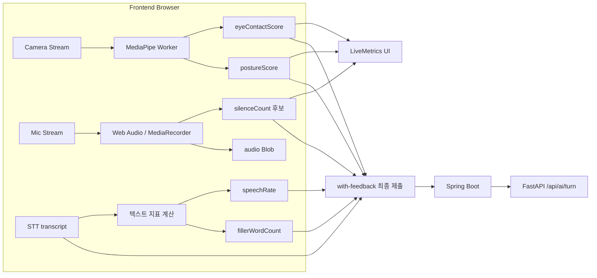
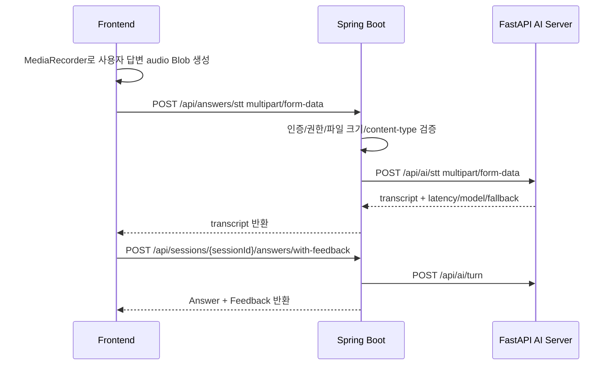
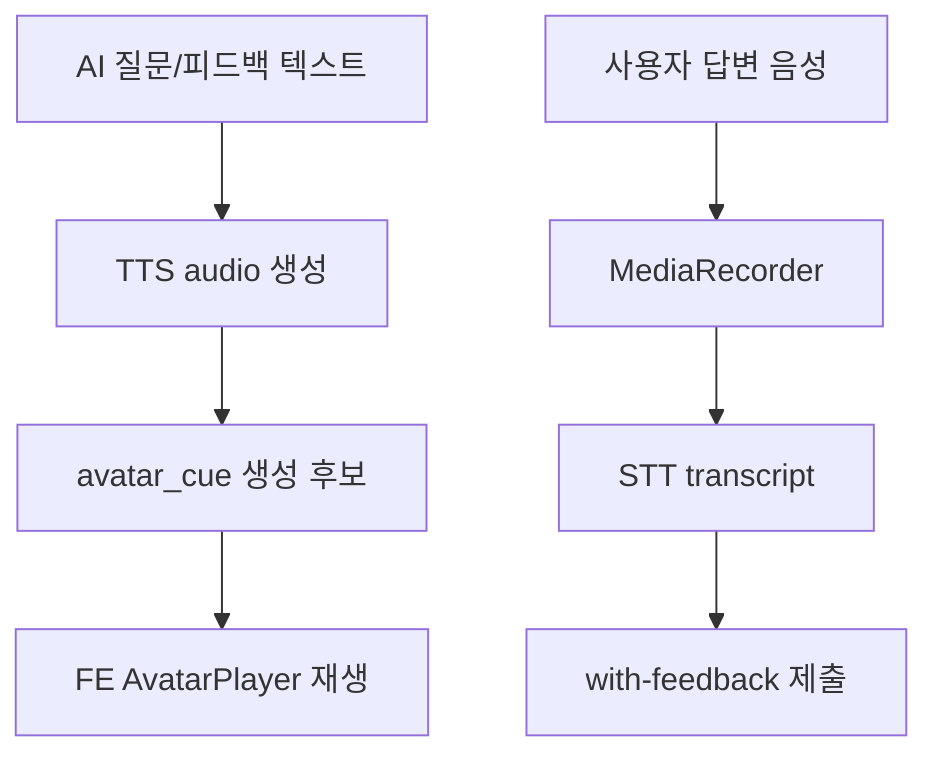
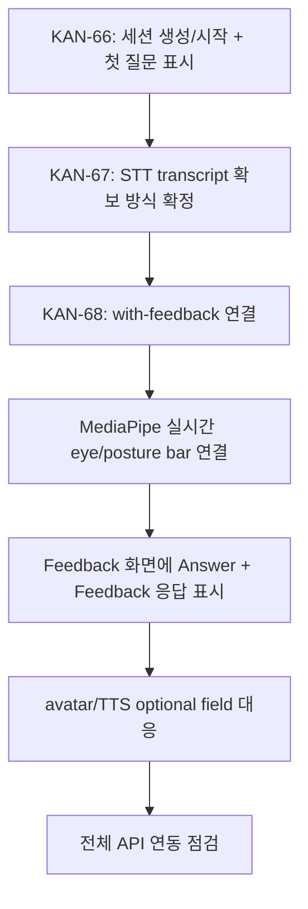

# Live AI/STT/MediaPipe 연동 논의 정리

작성일: 2026-05-06  
대상: Frontend / Spring Boot Backend / FastAPI AI Server 협업 논의

## 1. 결론 요약

현재 합의에 가까운 방향은 다음과 같다.

- 운영 환경에서 Frontend는 FastAPI AI Server를 직접 호출하지 않는다.
- Frontend는 Spring Boot 제품 API만 호출한다.
- MediaPipe 기반 실시간 카메라 지표는 Frontend 브라우저에서 계산하고 즉시 UI에 표시한다.
- Spring/AI Server에는 답변 종료 시점의 최종 집계값만 제출한다.
- STT는 별도 협의가 필요하다. 현재 `with-feedback` API는 transcript 기반이며 audio blob을 받지 않는다.
- 원본 오디오 파일은 MVP에서 저장하지 않는 방향이다. GCS는 사용자 document 저장과 LLM 활용을 위한 용도다.

## 2. 역할 경계

| 영역 | Frontend | Spring Boot Backend | FastAPI AI Server |
|---|---|---|---|
| 세션 생성/시작 | 세션 생성/시작 API 호출, 첫 질문 표시 | 세션 상태 관리, 첫 질문 생성 요청 중개 | 질문 생성, TTS URL 생성 후보 |
| 카메라 지표 | MediaPipe로 실시간 계산, LiveMetrics 표시 | 최종 점수 저장/전달 | 최종 지표를 피드백 생성에 참고 |
| 마이크 녹음 | MediaRecorder로 audio Blob 생성 가능 | STT 중개 API 필요 | STT 처리 |
| 텍스트 지표 | 실시간 UI에서는 제외, 제출 시점 계산 후보 | 필요 시 집계/검증 | 피드백 prompt 참고 |
| 답변/피드백 | 답변 종료 시 with-feedback 호출 | Answer 저장, AI turn 호출, Feedback 저장 | `/api/ai/turn` 평가 |
| 원본 파일 | 사용자 document 업로드 UI | GCS document 저장/상태 관리 | document context 활용 후보 |
| 아바타/TTS | audioUrl/avatarCue 재생 UI | FastAPI 응답을 FE 접근 가능 형태로 전달 | TTS/audio cue 생성 후보 |

## 3. 현재까지 확인된 Backend API

### 3.1 세션 시작

```http
PATCH /api/sessions/{sessionId}/start
```

요청 예시:

```json
{
  "mode": "INTERVIEW",
  "target": "BACKEND",
  "difficulty": "NORMAL"
}
```

응답은 공통 wrapper 안에 `session`과 `question`이 함께 내려온다.

```json
{
  "success": true,
  "data": {
    "session": {
      "id": 10,
      "status": "IN_PROGRESS",
      "mode": "INTERVIEW",
      "target": "BACKEND",
      "difficulty": "NORMAL",
      "answerTimeLimitSec": 120
    },
    "question": {
      "question_text": "120초 안에 백엔드 개발자에 지원한 이유와 가장 관련 있는 경험을 결론부터 설명해 주세요.",
      "question_intent": "지원 동기와 경험의 관련성을 구조적으로 확인합니다.",
      "tts_audio_url": "/static/tts/...",
      "latency_ms": 10,
      "fallback_components": ["llm", "tts"]
    }
  },
  "message": "요청이 성공했습니다."
}
```

### 3.2 답변 제출 및 AI 피드백 생성

```http
POST /api/sessions/{sessionId}/answers/with-feedback
```

요청 DTO 기준:

```json
{
  "questionText": "백엔드 개발자에 지원한 이유를 설명해 주세요.",
  "transcript": "저는 API 설계와 데이터 모델링 경험을 바탕으로...",
  "durationSec": 87,
  "speechRate": 120.5,
  "silenceCount": 2,
  "fillerWordCount": 3,
  "eyeContactScore": 80,
  "postureScore": 75,
  "sttStatus": "COMPLETED",
  "startedAt": "2026-05-06T16:10:00",
  "endedAt": "2026-05-06T16:11:27"
}
```

응답 DTO 기준:

```json
{
  "success": true,
  "data": {
    "answer": {
      "answerId": 1,
      "sessionId": 10,
      "questionText": "...",
      "transcript": "...",
      "durationSec": 87,
      "speechRate": 120.5,
      "silenceCount": 2,
      "fillerWordCount": 3,
      "eyeContactScore": 80,
      "postureScore": 75,
      "sttStatus": "COMPLETED",
      "startedAt": "2026-05-06T16:10:00",
      "endedAt": "2026-05-06T16:11:27",
      "createdAt": "2026-05-06T16:11:30"
    },
    "feedback": {
      "feedbackId": 1,
      "answerId": 1,
      "summary": "답변 구조는 명확하지만 구체적 수치가 부족합니다.",
      "evidence": "프로젝트 경험을 설명했지만 성과 지표가 부족했습니다.",
      "improvementExample": "응답 시간을 30% 개선한 경험처럼 수치 중심으로 보완하면 좋습니다.",
      "structureScore": 80,
      "specificityScore": 65,
      "relevanceScore": 75,
      "deliveryScore": 85,
      "createdAt": "2026-05-06T16:11:35"
    }
  },
  "message": "요청이 성공했습니다."
}
```

제약:

- 세션 상태가 `IN_PROGRESS`가 아니면 `INVALID_REQUEST`로 차단된다.
- 이 API는 audio blob을 받지 않는다.
- transcript가 이미 확보되어 있어야 한다.
- 상세 MediaPipe JSON을 받지 않고 `eyeContactScore`, `postureScore`만 받는다.

## 4. 전체 서비스 흐름

```mermaid
flowchart TD
  A[Home: 세션 시작하기 CTA] --> B[POST /api/sessions]
  B --> C[sessionId 확보]
  C --> D[문서 업로드 / READY_FOR_AI 확인]
  D --> E[mode / target / difficulty 선택]
  E --> F[PATCH /api/sessions/{sessionId}/start]
  F --> G[session + 첫 question 수신]
  G --> H[LiveScreen 진입]
  H --> I[질문 표시 / TTS 또는 아바타 발화 후보]
  I --> J[답변 시작]
  J --> K[FE: MediaPipe 카메라 지표 실시간 계산]
  J --> L[FE: 마이크 녹음 / STT transcript 확보]
  K --> M[LiveMetrics bar 표시]
  L --> N[transcript 확정]
  M --> O[답변 종료: 최종 지표 집계]
  N --> O
  O --> P[POST /api/sessions/{sessionId}/answers/with-feedback]
  P --> Q[Spring: Answer 저장]
  Q --> R[Spring -> FastAPI /api/ai/turn]
  R --> S[Spring: Feedback 저장]
  S --> T[FE: Feedback 화면 표시]
```

## 5. 실시간 지표와 최종 제출 지표 분리



### 실시간 UI에 적합한 지표

| 지표 | 실시간 표시 | 계산 위치 | 설명 |
|---|---:|---|---|
| `eyeContactScore` | 적합 | FE MediaPipe | 얼굴/시선 정면 유지 추정 |
| `postureScore` | 적합 | FE MediaPipe | 어깨 기울기/상체 안정도 추정 |
| `durationSec` | 적합 | FE timer | 답변 시간 |
| `silenceCount` | 일부 가능 | FE Web Audio | 음량 기반 침묵 구간 추정 |

### 실시간 UI에서 제외해도 되는 지표

| 지표 | 실시간성 | 계산 후보 |
|---|---|---|
| `speechRate` | 낮음 | 최종 transcript + duration 기반 |
| `fillerWordCount` | 낮음 | 최종 transcript 기반 |

## 6. MediaPipe 활용 방향

### 판단

MediaPipe 지표는 Spring까지 매 프레임 전송하지 않는다. FE에서 실시간 계산하고 UI에 표시한 뒤, 답변 종료 시 최종 점수만 제출한다.

### 이유

- LiveMetrics bar는 낮은 latency가 중요하다.
- 매초 서버 왕복을 하면 UI 반응성이 떨어질 수 있다.
- 카메라 raw landmark는 개인정보/용량 측면에서 서버로 보내지 않는 편이 안전하다.
- 현재 Backend DTO는 상세 vision JSON이 아니라 `eyeContactScore`, `postureScore`만 받는다.

### MVP 기준 점수화 후보

| 최종 필드 | FE 내부 계산 후보 |
|---|---|
| `eyeContactScore` | 얼굴 감지 비율, gaze forward ratio, longest gaze away 구간을 0~100으로 압축 |
| `postureScore` | shoulder tilt 평균, posture shift 이벤트, pose visibility를 0~100으로 압축 |

### 검증 필요 항목

- 브라우저에서 10~15fps 수준으로 안정 동작하는가
- 저사양 노트북/모바일에서 UI가 끊기지 않는가
- 카메라 권한 거부 시 transcript-only flow가 유지되는가
- 조명/안경/측면 얼굴 등에서 점수가 과도하게 흔들리지 않는가

## 7. STT 협의 필요 사항

현재 최신 Backend의 `with-feedback` API는 transcript를 요구한다. 따라서 STT는 별도 흐름이 필요하다.

### 권장안: 임시 STT 중개 API



제안 API:

```http
POST /api/answers/stt
Content-Type: multipart/form-data
```

요청 후보:

| 필드 | 타입 | 필수 | 설명 |
|---|---|---:|---|
| `file` | audio file | 예 | `audio/webm`, `audio/mp4`, `audio/ogg` 등 |
| `language` | string | 아니오 | MVP는 `ko` |
| `sessionId` | number | 아니오 | 권한/로그 연계가 필요하면 포함 |

응답 후보:

```json
{
  "transcript": "저는 백엔드와 AI 연동에 관심이 있습니다.",
  "sttStatus": "COMPLETED",
  "latencyMs": 1200,
  "modelName": "large-v3-turbo",
  "fallbackComponents": []
}
```

### ERD/GCS 영향

이 방식은 audio 원본을 저장하지 않는 임시 변환 API이므로 ERD 변경이 필수는 아니다.

원본 오디오를 보관해야 하는 경우에만 다음 항목이 추가 논의 대상이다.

- GCS object key 저장
- audio content type / size 저장
- STT 모델명 / latency 저장
- 재처리 이력 저장

현재 MVP 논의 기준에서는 오디오 원본 저장은 하지 않는 방향이다.

## 8. 아바타/TTS와의 관계

MediaRecorder는 사용자 답변 입력용이다. 아바타 입모양 cue와 직접 관련 없다.



중요한 타이밍 규칙:

- 아바타가 질문을 읽는 동안 사용자 녹음을 시작하지 않는다.
- 질문 발화 종료 후 1초 뒤부터 timer, STT, 평가용 MediaPipe metric 누적을 시작한다.
- 이렇게 해야 질문 TTS 음성이 사용자 답변 녹음에 섞이는 문제를 줄일 수 있다.

## 9. 현재까지 되어있는 사항

### Frontend

- `LiveMetrics` UI가 존재한다.
- `LiveAudioWaveform`은 Web Audio로 마이크 amplitude를 읽어 파형을 표시한다.
- 현재 develop 기준 LiveScreen의 eye/posture 값은 mock/random 성격이다.
- sibling 실험본에는 MediaPipe worker와 vision metric 집계 코드가 존재한다.
- sibling 실험본에는 MediaRecorder 기반 서버 STT hook이 존재한다.

### Backend

- `POST /api/sessions` 세션 생성이 존재한다.
- `PATCH /api/sessions/{sessionId}/start`가 `session + question`을 반환한다.
- `POST /api/sessions/{sessionId}/answers/with-feedback`가 존재한다.
- `with-feedback`는 Answer 저장 후 FastAPI `/api/ai/turn`을 호출하고 Feedback을 저장한다.
- 세션 상태가 `IN_PROGRESS`가 아니면 요청을 차단한다.
- 현재 `with-feedback`는 transcript 기반이다. audio file을 받지 않는다.
- 현재 `with-feedback`는 상세 MediaPipe JSON이 아니라 flat metric만 받는다.

### AI Server

- `/api/ai/questions`, `/api/ai/turn`, `/api/ai/reports` 계약이 존재한다.
- STT endpoint는 local/demo 또는 후속 제품 후보로 논의 중이다.
- 질문/피드백 응답의 `tts_audio_url`은 존재하지만, Spring의 제품 응답에 어떻게 노출할지는 추가 정리가 필요하다.

## 10. 추가로 손봐야 하는 사항

### FE

- Home에서 세션 생성 CTA/modal 추가
- `sessionId` 유지 및 문서 업로드/옵션 선택 흐름 연결
- 세션 시작 응답의 `question`을 Live 첫 질문으로 전달
- MediaPipe 기반 `eyeContactScore`, `postureScore` 실시간 계산 연결
- 답변 종료 시 flat metric으로 압축하여 `with-feedback` 호출
- STT API가 확정되면 MediaRecorder upload flow 연결

### Backend

- STT 중개 API 제공 여부 확정
- `with-feedback`가 상세 `audioMetrics`/`visionMetrics` JSON을 받을지, 현재 flat field만 유지할지 결정
- 피드백 응답에 `ttsAudioUrl`, `latencyMs`, `fallbackComponents`, 추후 `avatarCue`를 FE에 전달할지 결정
- AI Gateway 호출 시 내부 인증 토큰/header 정책 확인

### AI Server

- 제품 기준 STT endpoint 활성화 여부 확정
- `avatar_cue`를 question/turn 응답에 optional로 추가할지 확정
- TTS URL을 Spring이 proxy/변환하기 쉬운 형태로 유지

## 11. 제안 작업 순서



MVP 우선순위:

1. 세션 생성/시작과 첫 질문 표시
2. transcript 확보 방식 결정
3. `with-feedback` 연결
4. MediaPipe 실시간 UI 지표 연결
5. 상세 metric/아바타/TTS 확장

## 12. 회의 때 확인할 질문

- STT는 별도 Spring 중개 API로 제공할 것인가?
- STT API가 생긴다면 audio 원본은 저장하지 않는 임시 변환 방식으로 갈 것인가?
- `with-feedback` request는 현재 flat field 5개를 유지할 것인가, 상세 `audioMetrics`/`visionMetrics` JSON으로 확장할 것인가?
- 피드백 응답에 FastAPI의 `tts_audio_url`, `latency_ms`, `fallback_components`를 FE에 노출할 것인가?
- `avatar_cue`는 MVP-2 이후 optional field로 준비할 것인가?
- MediaPipe 실시간 지표의 제품 기준은 점수 보조 UI인가, 실제 평가 핵심 근거인가?

